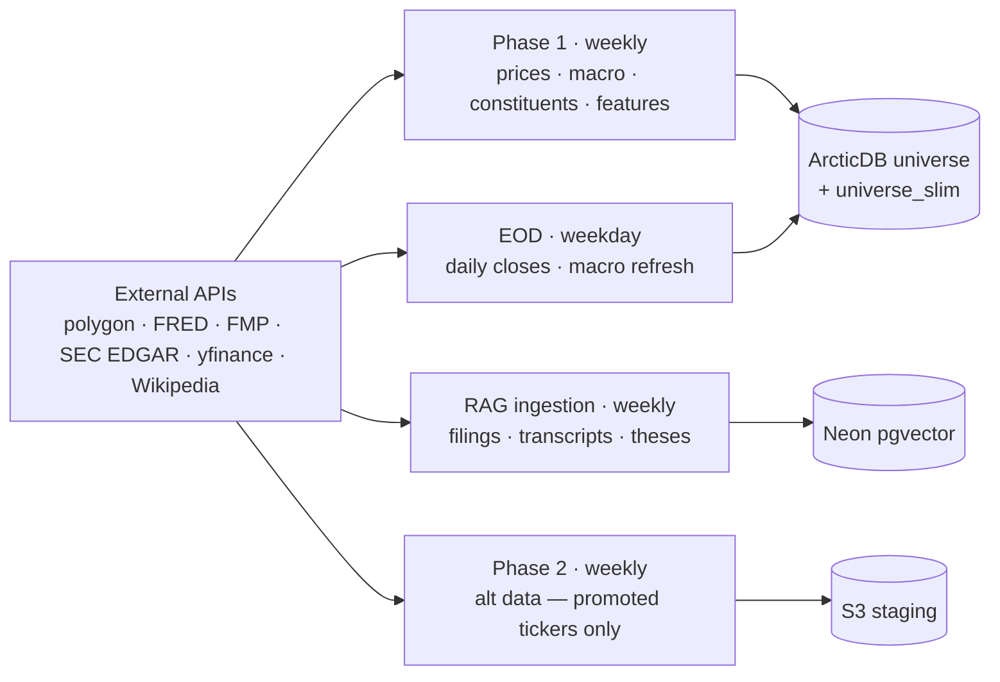

# alpha-engine-data

> Part of [**Nous Ergon**](https://nousergon.ai) — Autonomous Multi-Agent Trading System. Repo and S3 names use the underlying project name `alpha-engine`.

Centralized data collection, storage, and distribution. Owns the price universe (ArcticDB), macro indicators, universe returns, the engineered feature store, the RAG ingestion step, and per-ticker alternative data.

> System overview, Step Function orchestration, and module relationships live in [`alpha-engine-docs`](https://github.com/cipher813/alpha-engine-docs). Code index lives in [`OVERVIEW.md`](OVERVIEW.md).

## What this does

- Maintains a 10-year ArcticDB price universe across ~900 S&P 500+400 tickers, refreshed weekly with daily EOD appends
- Ingests macro indicators from FRED (rates, VIX, commodities) and computes derived signals (yield-curve slope, VIX term slope, market breadth)
- Pulls per-ticker alternative data (analyst consensus, EPS revisions, options chains, insider filings, 13F holdings, news sentiment) only for tickers promoted by Research — keeps API spend bounded
- Computes the engineered feature store used by the Predictor for both training and inference
- Runs the RAG ingestion step: SEC 10-K/10-Q/8-K, earnings transcripts, and thesis history embedded into the pgvector knowledge base that Research's qual-analyst agents query

## Phase 2 measurement contribution

Data is the substrate everything else measures against. Phase 2 contribution: feature coverage, freshness tracking, and per-feature drift detection that downstream modules can rely on. Every signal, prediction, and trade traces back to inputs that have been validated, freshness-checked, and tagged with quality flags.

## Architecture

Quality gates run automatically after each refresh: OHLC ordering, zero-price, extreme returns, zero-volume, volume-spikes, trading-day gaps. Anomalies surface in per-step completion emails.

## Configuration

This repo is **public**. `config.yaml` is gitignored locally; real values (S3 bucket names, API keys, email recipients) live in the private [`alpha-engine-config`](https://github.com/cipher813/alpha-engine-config) repo. Architecture and approach are public; specific values are private.

## Sister repos

| Module | Repo |
|---|---|
| Executor | [`alpha-engine`](https://github.com/cipher813/alpha-engine) |
| Research | [`alpha-engine-research`](https://github.com/cipher813/alpha-engine-research) |
| Predictor | [`alpha-engine-predictor`](https://github.com/cipher813/alpha-engine-predictor) |
| Backtester | [`alpha-engine-backtester`](https://github.com/cipher813/alpha-engine-backtester) |
| Dashboard | [`alpha-engine-dashboard`](https://github.com/cipher813/alpha-engine-dashboard) |
| Library | [`alpha-engine-lib`](https://github.com/cipher813/alpha-engine-lib) |
| Docs | [`alpha-engine-docs`](https://github.com/cipher813/alpha-engine-docs) |

## License

AGPL-3.0-only — see [LICENSE](LICENSE). Commercial licenses available — contact brian@nousergon.ai.
